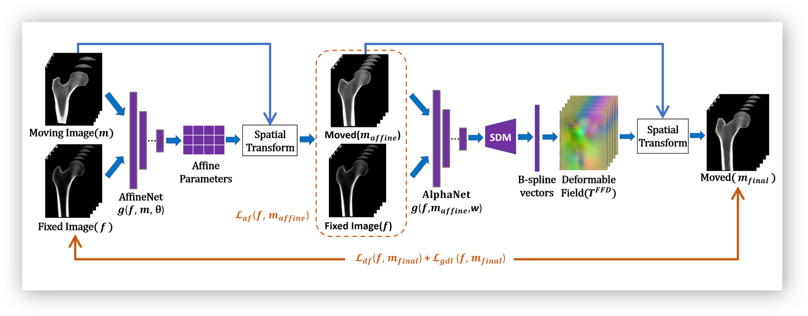
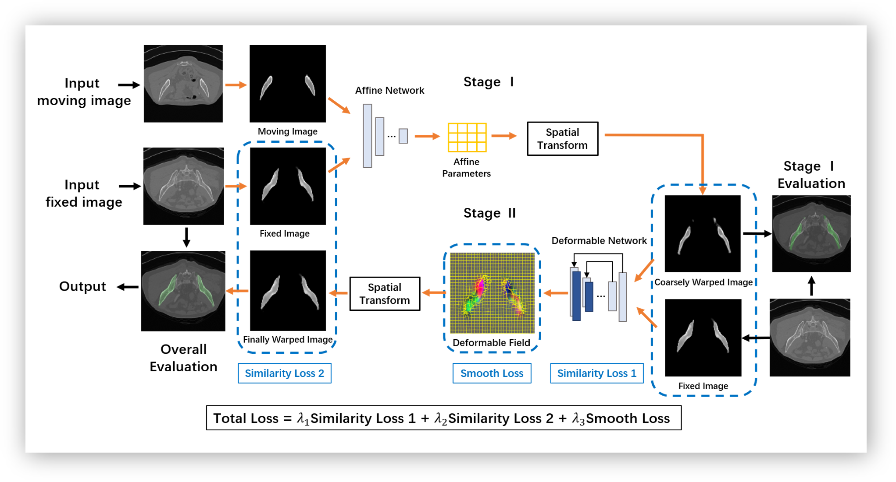
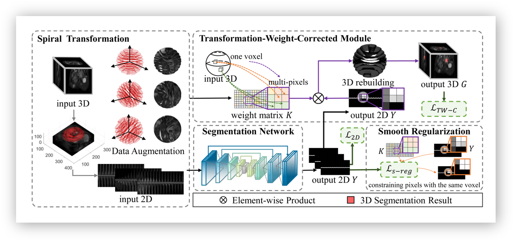

<h1>Biograghy</h1>
I am currently a fourth year undergraduate student in School of Biomedical Engineering, Shanghai Jiao Tong University (SJTU). And I am also a member of Zhiyuan Honors Program of Engineering, an elite student program in SJTU. During the university period, I have some research experience under the supervision of Prof. Qi Dou, Prof. Guoyan Zheng and Prof. Xiaohua Qian.

My research interests lie on medical image analysis and computer vision, including segmentation, registration and detection related to medical topics and deep learning. Recently, I mainly focus on developing generalisable model that can be applied across clinical centers.

I am actively looking for a PhD position!

<h1 class="body">News</h1>
* No news is the best news!

<h1 class="body">Publications</h1>
<!-- 

 -->
<table id="tbPublications" width="100%">
    <tbody>
    <tr>
        <td width="270">
        
        </td>
        <td><b>DeepASDM: a Deep Learning Framework for Affine and Deformable Image Registration Incorporating a Statistical Deformation Model.</b>[<a href="https://ieeexplore.ieee.org/abstract/document/9508553">paper</a>] 
        Xiaoru Gao, Jeroen Van Houtte, <b>Zihao Chen</b>, Guoyan Zheng 
        IEEE EMBS International Conference on Biomedical and Health Informatics (<b>BHI</b>), 2021 
        </td>
    </tr>
    <tr>
        <td width="270">
        
        </td>
        <td><b>An End-to-end Unsupervised Affine and Deformable Registration Framework for Multi-structure Medical Image Registration.</b> 
        <b>Zihao Chen</b>, Xiaoru Gao, Guoyan Zheng 
        International Congress and Exhibition of Computer Assisted Radiology and Surgery (<b>CARS</b>), 2021 [Abstract] 
        </td>
    </tr>
    <tr>
        <td width="270">
        
        </td>
        <td><b>Model-driven Deep Learning Method for Pancreatic Cancer Segmentation Based on Spiral-transformation.</b>[<a href="https://ieeexplore.ieee.org/abstract/document/9512056">paper</a>] 
        Xiahan Chen, <b>Zihao Chen</b>, Jun Li, Yu-Dong Zhang, Xiaozhu Lin, Xiaohua Qian  
        IEEE Transactions on Medical Imaging (<b>TMI</b>), 2021  
        </td>
    </tr>
</tbody></table>

<h1 class="body">Selected Projects</h1>


<h1 class="body">Honors and Awards</h1>
* 2019, 2020 Zhiyuan Honor Scholarship (Top 5%)
* 2019, 2020 Second-class Scholarship (Top 10%)
